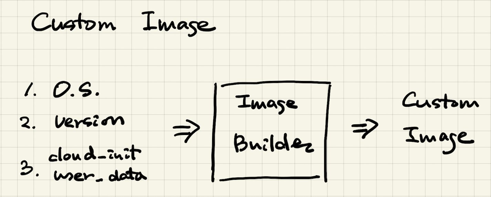
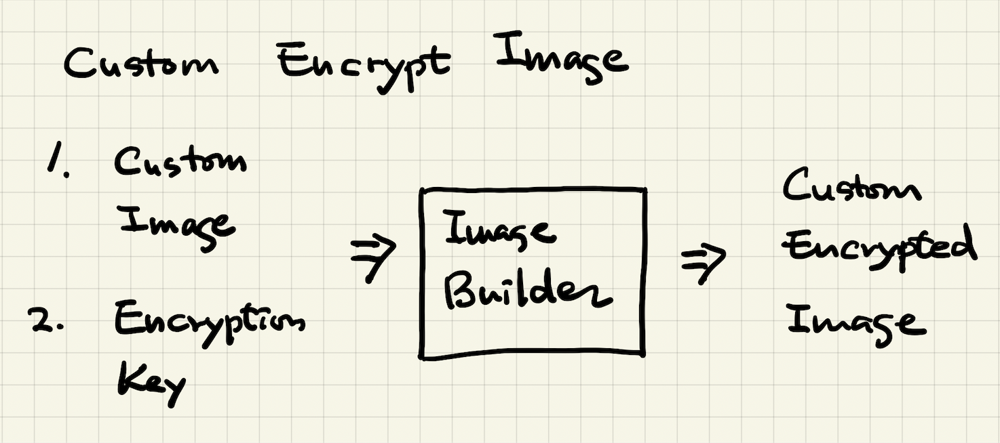
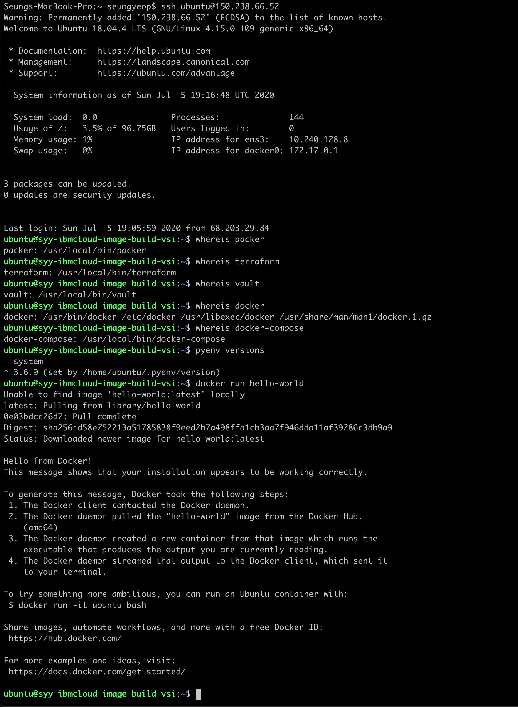

# ibmcloud-image-builder

 [](https://travis-ci.org/IBM-Cloud/ibmcloud-image-builder)

https://hub.docker.com/r/syibm/ibmcloud-image-builder

https://hub.docker.com/r/syibm/ibmcloud-image-builder-ubuntu

# Try it out

This project is set up to run on Linux only at this moment.

There is a way to build images on macOS, but the user needs to install lots of tools instead of using Docker provided by this repo... that's not very convenient. The details can be found in [ISSUE-77](https://github.com/IBM-Cloud/ibmcloud-image-builder/issues/77).

## Dependencies

Before you can build a custom image you must install the following dependencies:

* [Docker](https://www.docker.com/products/docker-desktop)
* make


## Building your first custom image

Start by pulling an already built image from the Docker registry.  This will download, encrypt, and package the image for deployment.

```
git clone git@github.com:IBM-Cloud/ibmcloud-image-builder.git
cd ibmcloud-image-builder
docker pull syibm/ibmcloud-image-builder
docker tag  syibm/ibmcloud-image-builder ibmcloud-image-builder
make build-all
```


# Motivation

### Declarative Image Build
What required to build a cloud image, **declaratively**? The minimum requirements will be the name and version of the Operation System. That's the start, when someone wants to customize an image with the list of one's desirable packages in terms of cloud image, then the list of packages will be `cloud-init` user data. That should be it to build a cloud image, and an image builder should take care of the rest of chores. That's the motivation of this project: Building a cloud image declaratively.



### Custom Encrypted Image
The same token applies to encrypt an image. Anyone should be able to build one by just providing an uncrypted image and encryption key.




# Introduction

This repo is for the project that is going to build various virtual machine images in `qcow2` format. The images can be imported into IBMCLOUD Cloud Object Storage (COS) and be served as custom images.

The required tools are from open source projects such as:
* [QEMU](https://www.qemu.org)
* Hashicorp [Packer](https://github.com/hashicorp/packer)

The base images that will be built upon:
* [Ubuntu](https://cloud-images.ubuntu.com)
* [CentOS](https://cloud.centos.org/centos/7/images/)
* TBD

This repo will also provide how to encrypt the images with Linux Unified Key Setup `luks` based encryption so that those encrypted images can be imported and used to spin up Virtual Server Instances (VSI) from IBM Virtual Private Cloud Generation 2.

The docker image that has all the required tools to build this VM images can be pulled from docker hub: https://hub.docker.com/r/syibm/ibmcloud-image-builder

### The CI environment will be provided as a `Dockerfile` based on Alpine latest, and the CI environment will include:
* [qemu](https://www.qemu.org)
* [packer](https://github.com/hashicorp/packer)
* cloud-utils
* ansible

The building time of this Docker image is < 1 min, I guess it can be used as an alternative while preparing docker pull from docker hub.


### The development environment will be provided as a `Dockerfile.ubuntu` based on Ubuntu 20.04, and the development environment will include:
* [qemu](https://www.qemu.org)
* [packer](https://github.com/hashicorp/packer)
* [ibmcloud cli client](https://github.com/IBM-Cloud/ibm-cloud-cli-release) & plugins
* [terraform](https://github.com/hashicorp/terraform) 0.12.29, 0.13.2 & tfenv & [terraform-provider-ibm](https://github.com/IBM-Cloud/terraform-provider-ibm)
* cloud-utils
* go 1.13
* python3 3.6.9 (pyenv, pipenv)
* ansible 2.9.9
* texlive-full 2019
* graphviz 2.42
* noweb 2.11b

The building time of this Ubuntu Docker image is > 10 mins from my machines, it takes very long. While preparing a repository in docker hub, maybe worthy to try once. It won't be changed very often any more. This Ubuntu Docker image assumes that you are running the Docker container from a Ubuntu host by default. You can change the `docker-compose.yml` file
to run this Docker image from another host OS flavor.

The Ubuntu docker image that has all the development tools can be pulled from docker hub: https://hub.docker.com/r/syibm/ibmcloud-image-builder-ubuntu

# Available images

So far we have Ubuntu 18.04 and CentOS 7 images as below:
* Ubuntu 18.04 Base
* Ubuntu 18.04 Base + Docker Installed
* CentOS 7 Base
* CentOS 7 Base + Docker Installed

```
$ tree -L 3
.
├── centos
│   └── 7
│       ├── base
│       └── docker
└── ubuntu
    ├── bionic
    │   ├── base
    │   └── docker
    ├── focal
    └── xenial

10 directories, 0 files
```

# How To

Without building the dev docker, just pull the docker image:
```
$ git clone git@github.com:IBM-Cloud/ibmcloud-image-builder.git
$ cd ibmcloud-image-builder
$ docker pull syibm/ibmcloud-image-builder
$ docker tag  syibm/ibmcloud-image-builder ibmcloud-image-builder
$ make build-all
```

Or we can build the docker image(`make pre-build`) locally as below:
```
$ git clone git@github.com:IBM-Cloud/ibmcloud-image-builder.git
$ cd ibmcloud-image-builder
$ make pre-build
$ make build-all
```

Note: If a new packer template needs to be created, then please repeat yourself.
The extra `docker` templates in addtion to `base` templates are for the information purpose on how to add new templates.

1. copy the existing folder and rename the directory
2. change either shell/user-data.sh or ansible/playbook.yml


# How to build an encrypted image with your DEK (Data Encryption Key)

By default all the images will be encrypted with a given `encryption key`: `JustMySimpleSecret`. If the image required to be encrypted with a different encryption key, then attach to the build docker, and
```
./packer-build.sh packer/os/platform "Your DEK here"
```

```
$ tree -L 5
.
├── centos
│   └── 7
│       ├── base
│       │   ├── ansible
│       │   │   └── playbook.yml
│       │   ├── http
│       │   ├── packer.json
│       │   └── shell
│       │       └── user-data.sh
│       └── docker
│           ├── ansible
│           │   └── playbook.yml
│           ├── http
│           ├── packer.json
│           └── shell
│               └── user-data.sh
└── ubuntu
    ├── bionic
    │   ├── base
    │   │   ├── ansible
    │   │   │   └── playbook.yml
    │   │   ├── http
    │   │   ├── packer.json
    │   │   └── shell
    │   │       └── user-data.sh
    │   └── docker
    │       ├── ansible
    │       │   └── playbook.yml
    │       ├── http
    │       ├── packer.json
    │       └── shell
    │           └── user-data.sh
    ├── focal
    └── xenial

22 directories, 12 files
```

# Example Virtual Server Instance created with the custom image generated with one of the templates




# Acknowledgement
Thanks to the contributors, colleagues and IBM for sponsoring this project.

* Nhat-Quang Dao
* kalyani489
* Albert Camacho
* Chad Huesgen
* Dan Wiggins
* Zack Grossbart
* Irene Yip
* IBM CloudLab
* IBM
